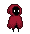

# Visiting Grandmma

## GAME DESIGN DOCUMENT

Creado por: Rocío Fortes Pérez

Versión del documento: 1.0

## HISTORIAL DE REVISIONES

| Versión | Fecha | Comentarios |
| --- | --- | --- |
| 1.00 | 27/04/23 | Creación del documento |
| < versión > | < fecha > | < comentario > |

> - *Mantén el orden de versión de manera creciente*
> - *Cada versión tendrá un comentario indicando los cambios realizados*
> - *Añade nuevas filas en caso necesario*

## RESUMEN

### Concepto

> *Caperucita Roja ha perdido una abuela a manos del lobo feroz, pero no perderá a la otra!!!. Cada vez que vaya a visitarla, no permitirá que nada ni nadie se interponga en su camino.*

### Puntos Clave

> *En forma de lista, explica las características principales del juego, de forma que permita entender la experiencia de juego. Enfatiza los elementos más importantes, divertidos y/o innovadores. Procura que haya un mínimo de 5 puntos clave*

### Género

> *Se trata de un plataformas 2D*

### Público Objetivo

>
> *Para los nostálgicos de los plataformas tipo Super Mario o Commander Keen, o para todo aquel que quiera divertirse un rato sin grandes complicaciones. Es un videojuego para todos los públicos.*

### Experiencia de Juego

> *El jugador será una Caperucita cabreada por la pérdida de una abuela. A partir de ahora, irá a visitar a la otra abuela, pero cada día por una ruta diferente y eliminando a toda aquella criatura malvada que se cruce en su camino. El jugador podrá saltar, disparar, eliminar enemigos y recolectar frutas (debe recogerlas todas) para una tarta que le preparará su abuela. La música de fondo le aporta cierto misterio, así como el degradado en las transiciones entre niveles.*

## DISEÑO

### Metas de Diseño

>+ **Entretenimiento:**
>*Se busca que sea un juego que mantenga al jugador pegado a la pantalla.*
>
> + **Jugabilidad:**
> *Controles sencillos y una mecánica simple hacen que el jugador aprenda enseguida cómo manejarse en el juego.*
>
> + **Complicidad:**
> *El aspecto malvado de los enemigos, así como el hecho de que todo el mundo conoce el cuento de Caperucita Roja, hacen que el jugador empatice rápidamente con el personaje.*
## MECÁNICAS DE JUEGO

### Núcleo de Juego

> *Hay varios elementos con los que el jugador podrá interactuar. Tendrá plataformas en las que poder subirse para acceder a zonas más altas, o para poder recoger frutas. También podrá encontrar en algunas zonas plataformas en movimiento, que tendrán la misma finalidad que las plataformas fijas, pero que permitirán acceder a frutas que no serían accesibles de otra forma, así como acceder a zonas más altas. Para saltar, habrá que pulsar la tecla espaciadora.
> Por otro lado están las frutas, que aumentarán la puntuación, y que además es obligatorio que las recoja todas para poder pasar al siguiente nivel. Para recogerlas basta con atravesarlas.
> A mayores están los elementos que producen daños al jugador, quitándole una vida cada vez que entran en contacto. Se trata de las trampas y de los enemigos, que son de 3 tipos: murciélagos, lobos y hombres lobo. Cada enemigo se puede eliminar disparando, pulsando la tecla Ctrl. izqd. y cada enemigo se elimina con un número diferente de disparos, en función de su tamaño: 1 para los murciélagos, 2 para los lobos y 3 para los hombres lobo.
> En algunas zonas, más bien escondidas, también encontraremos un corazón, que será una vida extra, siempre y cuando el número de vidas que tenemos sea inferior o igual a 3.
> Si el personaje pierde una vida, vuelve al punto de partida inicial. Y si se pierden todas las vidas, aparecerá un mensaje de GameOver, que nos indicará qué hacer para que nos lleve de vuelta a la pantalla inicial.
> Una vez recogida la última fruta, se pasa de nivel de forma automática.>*

### Flujo de Juego

### Fin de Juego

> + La partida puede terminar en caso de perder todas las vidas. El jugador comienza la partida con 3 vidas, y si toca alguna de las trampas, o en caso de entrar en contacto con alguna de las criaturas enemigas, perderá una vida. Al perder las 3 vidas, pierde la partida, y se vuelve a la pantalla inicial.
>
> + Otra forma en la que puede concluir la partida es ganando todos los niveles. Para poder avanzar y pasar de un nivel a otro es necesario que el jugador no pierda todas las vidas y que recolecte todas las frutas del nivel en el que se encuentra.

### Física de Juego

> *El jugador podrá desplazarse sobre el terreno, así como entrar en cuevas, saltar sobre plataformas (fijas y en movimiento), y además tiene la capacidad de disparar, tanto parado (idle) como moviéndose (run). Cuando cae, aunque sea de gran altura, no recibe daño alguno.*
> 

### Controles

## MUNDO DEL JUEGO

### Descripción General

> *El videojuego transcurre en un bosque, lleno de cuevas y distintos escenarios que el jugador debe sortear para llegar a casa de la abuela. Es un lugar lleno de peligros y misterio.*

### Personajes

> + **Jugable**
> 
> La protagonista de este juego es una versión de Caperucita Roja. Es una versión un tanto más oscura que la tradicional. Es más rápida, desconfiada y agresiva. Puede saltar y disparar, además de recolectar fruta por el bosque.
> 
>
> + **Secundarios**
> Sería la abuela de Caperucita, pero no es visible en el juego. Se presupone que está dentro de la casa que aparece al final de cada nivel.
> 
> + **Enemigos**
>Tenemos 3 tipos de enemigos:
>**1.-Murciélagos:**
>
>Están volando dentro de cuevas. Pueden atacar en cuanto se acerca el jugador.
>**2.-Lobos:**
>
>Suelen rondar la casa de la abuela, y no dudarán en atacar al jugador.
>**3.-Hombres Lobo:**
>
>Los encontramos tanto en cuevas como por el bosque. Atacarán sin dudar al jugador.

### Objetos

> + **Frutas**
>
>Son unas cerezas que el jugador debe ir recogiendo por las distintas zonas de cada nivel. Añaden puntuación y además es imprescindible recogerlas todas para avanzar al siguiente nivel. Están en la capa Collectible y contienen una pequeña animación en bucle que las mueve de lado a lado en un pequeño bamboleo.
>+ **Corazón**
>
> En caso de que el usuario no tenga todas las vidas (hasta un máximo de tres) y se encuentre con uno de estos corazones (hay uno en cada nivel) obtendrá una vida extra. Se trata de un power-up y tiene una pequeña animación que lo mueve arriba y abajo para hacerlo algo más visible. Si el jugador tiene las vidas al máximo, no podrá recogerlo y no pasará nada cuando trate de recogerlo.

### Flujo de Pantallas

>
> + **Pantalla de Presentación:**
> Se trata de la Scene-00. En ella simplemente aparece una imagen de la protagonista, con el bosque de fondo. En la parte superior podemos ver el nombre del videojuego, y en la esquina inferior derecha, podremos ver los controles del juego. También vemos en el medio un mensaje que nos dice que pulsemos Return para iniciar el juego.
>
> + **Nivel 1:**
> Comenzamos por el bosque, y podremos acceder a una pequeña cueva donde encontraremos unas cuantas frutas, trampas y un murciélago, así como unas cuantas plataformas. Al salir, tendremos otras plataformas donde recoger frutas, y un poco más adelante encontraremos otra cueva, esta algo más grande. En el lado derecho tendremos frutas, plataformas y una vida extra, y el el izquierdo, tendremos una plataforma móvil, frutas y un hombre lobo al que tendremos que eliminar para poder recoger la fruta que custodia. Al salir de la cueva hacia la derecha, habrá un lobo casi en la puerta de la casa de la abuela. Tendremos que eliminarlo para poder recoger la última fruta y pasar al siguiente nivel.
>
> + **Nivel 2:**
> Este nivel es casi todo bajo tierra. Se trata de una gran cueva llena de murciélagos y trampas. Hay muchas plataformas a las que habrá que acceder para ir recolectando las frutas. En la parte más baja de la cueva encontraremos trampas, un hombre lobo, una vida extra, y una plataforma móvil que nos ayudará para salir de la cueva, teniendo cuidado con los murciélagos. Casi al final de la cueva, encontraremos un lobo, y otro custodiando la casa de la abuela. Habrá que eliminarlos para poder recoger todas las frutas y pasar al siguiente nivel.
>
> + **Nivel 3:**
> Es el nivel más complicado. Comienza en una zona con pendiente. Casi al comienzo hay un pequeño foso donde encontraremos un lobo y una trampa, así como algunas plataformas y frutas. A Continuación, nos encontraremos con una gran cueva, llena de murciélagos, plataformas y trampas. Una plataforma móvil nos llevará a la parte más alta de la cueva. En ella encontraremos, además de más murciélagos, frutas y una vida extra, que está en la parte más recóndita de la cueva. Al salir de la cueva, tendremos que subir hacia casa de la abuela, esquivando más trampas, un lobo y un hombre lobo, para poder recoger las frutas correspondientes.
>
>Como no se han desarrollado más niveles, al recolectar todas las frutas del tercer nivel, automáticamente nos llevará de vuelta a la pantalla inicial.
> En todas las pantallas, en caso de que el jugador pierda todas las vidas, se encontrará en una situación de GameOver, y pulsando Return volverá a la pantalla inicia. Así mismo, en cualquier momento, podría pulsar la tecla Esc y salir del juego, terminando así la partida.
>

### HUD

>
>*En la parte superior izquierda de la pantalla encontraremos las vidas, representadas por corazones. Aparecerán las que nos quedan, pero no la que estamos usando en ese momento. En la parte superior central, veremos el nivel en el que nos encontramos, y por último, en la parte superior derecha, veremos la puntuación obtenida hasta el momento. Lo podremos encontrar en todos los niveles, salvo la pantalla de inicio.*
>
>
>*Cuando el jugador pulse la tecla 'P', se pausará o reanudará el juego. Al pausar, nos aparecerá este rótulo, indicando así al jugador que el juego está pausado, y que para reanudar el mismo, debe pulsar nuevamente 'P'.  Lo podremos visualizar en todos los niveles, salvo la pantalla de inicio.*
>
>
>*Por último, en caso de perder todas las vidas, se informará al jugador de que ha perdido (Game Over) y deberá pulsar Return para volver a la pantalla inicial. Al igual que los elementos anteriores, lo podremos ver en todos los niveles, salvo la pantalla de inicio.*

## ARTE

### Metas de Arte

> *El objetivo principal es el representar un bosque misterioso, lleno de peligros. Caperucita aparece como una versión oscura, a la que no podemos ver su rostro. Los enemigos son feroces y muy agresivos, y por ese motivo, se ha dotado a Caperucita de la capacidad de defenderse disparando. Muchos de los escenarios son cuevas, lo cual hace que sea todavía más tenebroso.*

### Assets de Arte

> + **1.-Ambientación**
> *Se ha empleado un fondo compuesto por dos imágnes para poder crear un efecto parallax. A mayores se han empleado distintos tipos de tileset para poder crear los distintos escenarios, compuestos tanto de zonas al aire libre, como por cuevas
>
> 
> + **2.-Personaje**
> *Tiene varias animaciones. Por un lado tiene la animación de Idle que es la que veremos cuando el personaje no se está desplazando. Si se mueve a derecha o izquierda, lo que veremos será la animación de Run, y si salta tiene otra animación para representar ese movimiento especial. En caso de disparar, veremos también que se reproduce otra animación, que es la de Attack, y por último, en caso de perder una vida, veremos la animación Death.*
>
> + **3.-Enemigos**
>*A pesar de que los enemigos son distintos, todos tienen las mismas animaciones. En principio los encontraremos desplazándose a derecha e izquierda. En caso de detectar cerca al jugador, se reproducirá la animación de ataque y por último, cuando son eliminados, se reproduce una animación de una pequeña explosión.*
> 
> 

## AUDIO

### Metas de Audio

>*En este videojuego se trata de mantener el misterio de no saber qué nos encontraremos a cada paso que damos. Por este motivo, se ha utilizado una música de fondo con un cierto toque alegre pero intrigante.*
>*Cuando fallece el protagonista se podrá oir un pequeño gemido, y cuando dispara, se oirá el sonido del mismo. Por otro lado cuando muere un enemigo, se oirá un gruñido. 
>Por último, en caso de que el jugador pierda todas las vidas, se oye una risa malvada de fondo, de alguna criatura del bosque.*
> 

### Assets de Audio

 >  ### 1.-Música
 >*Para la música de fondo sólo se ha empleado una pista de audio, de nombre FarBeyond Studio - Freebies Vol. 1 - 05 - Sneaky (CC-BY 4.0). Esta pista se reproduce en bucle a lo largo de todo el videojuego.*
 >
 >  ### 2.-Sonidos
 > + **Personaje**
 >*El personaje dispone de dos sonidos. Uno es el del disparo (zapsplat_warfare_bullets_x3_hit_body_quick_succession_43621), y otro es el de la muerte del personaje (PlayerHurt). En caso de que el personaje pierda todas las vidas de que dispone, se dará una situación de GameOver, que se acompaña de una risa malvada (CreepyLaugh).*
 >+ **Collectables y Power-Up**
 >*Las frutas emiten un sonido cada vez que se recoge una (ItemJingle), y en caso de que el personaje recoja un Power-Up para una vida extra, se emitirá un sonido que indica que se dispone de una vida extra (powerup). Este mismo sonido se emplea (al menos por el momento) para indicar al jugador que ha acabado con éxito el nivel y que pasa al siguiente.*
>+ **Enemigos**
>*Los enemigos sólo emiten sonido cuando se les mata, en cuyo caso se escuchará una especie de gruñido (EnemyDeath).*

## DETALLES TÉCNICOS

### Plataformas Objetivo

>*El videojuego está pensado para utilizar en PC o Portátil con Sistema Operativo Windows. Será un ejecutable. Se requiere un Windows con arquitectura de 64 bits, y pantalla 16:9.*

### Herramientas de Desarrollo

> + *En este videojuego se ha utilizado Unity Hub y Unity 2021.3.11f1, el editor de fotos PhotoPad para Windows, el IDE VisualStudioCode V 1.78.0 y Microsoft Edge para descargar diferentes Assets de arte y música para el videojuego.*
> + *El arte y los sonidos se han obtenido en su totalidad de https://itch.io/, los flujos de este documento se han realizado en https://lucid.app/, y la fuente del videojuego procede de https://www.1001freefonts.com/es/video-game-fonts.php*
